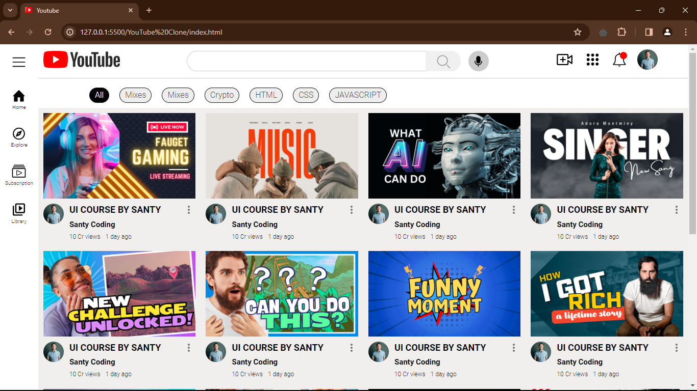

# YouTube Clone Project

## Demo

Check out the live demo [here](https://yogendrabhammarkar57.github.io/Youtube-Clone/).

This is a simple YouTube clone project created solely with HTML and CSS. It aims to replicate the basic functionalities and layout of the YouTube website using only front-end technologies.

## Features

- Responsive design: The clone is designed to be responsive and adaptable to different screen sizes.
- Home Page: Displays a list of video thumbnails, titles, and descriptions similar to the YouTube homepage.
- Video Player: Clicking on a video thumbnail opens a video player with a placeholder for the video.
- Sidebar: Includes a sidebar with recommended channels and other miscellaneous links.
- Styling: The project utilizes CSS to mimic the visual style of YouTube, including the header, footer, and overall layout.

## Usage

To view the YouTube clone, simply open the `index.html` file in a web browser.

## Contributing

Contributions are welcome! If you'd like to improve the project or add new features, feel free to fork the repository and submit a pull request.

## License

This project is licensed under the MIT License. See the [LICENSE](LICENSE) file for details.

## Acknowledgements

- This project was inspired by the YouTube website.
- Created as part of a learning exercise to practice HTML and CSS skills.
